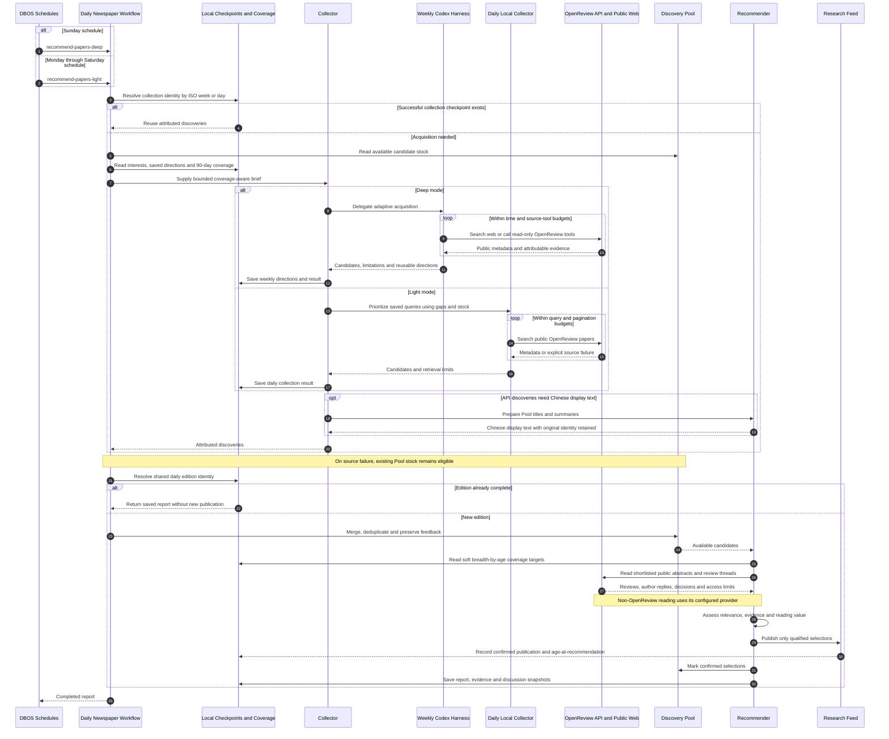

# Research newspaper sequence

```mermaid
sequenceDiagram
    autonumber
    participant Schedule as DBOS Schedules
    participant Daily as Daily Newspaper Workflow
    participant State as Local Checkpoints and Coverage
    participant Collector
    participant Codex as Weekly Codex Harness
    participant Local as Daily Local Collector
    participant Sources as OpenReview API and Public Web
    participant Pool as Discovery Pool
    participant Editor as Recommender
    participant Feed as Research Feed

    alt Sunday schedule
        Schedule->>Daily: recommend-papers-deep
    else Monday through Saturday schedule
        Schedule->>Daily: recommend-papers-light
    end
    Daily->>State: Resolve collection identity by ISO week or day
    alt Successful collection checkpoint exists
        State-->>Daily: Reuse attributed discoveries
    else Acquisition needed
        Daily->>Pool: Read available candidate stock
        Daily->>State: Read interests, saved directions and 90-day coverage
        Daily->>Collector: Supply bounded coverage-aware brief
        alt Deep mode
            Collector->>Codex: Delegate adaptive acquisition
            loop Within time and source-tool budgets
                Codex->>Sources: Search web or call read-only OpenReview tools
                Sources-->>Codex: Public metadata and attributable evidence
            end
            Codex-->>Collector: Candidates, limitations and reusable directions
            Collector->>State: Save weekly directions and result
        else Light mode
            Collector->>Local: Prioritize saved queries using gaps and stock
            loop Within query and pagination budgets
                Local->>Sources: Search public OpenReview papers
                Sources-->>Local: Metadata or explicit source failure
            end
            Local-->>Collector: Candidates and retrieval limits
            Collector->>State: Save daily collection result
        end
        opt API discoveries need Chinese display text
            Collector->>Editor: Prepare Pool titles and summaries
            Editor-->>Collector: Chinese display text with original identity retained
        end
        Collector-->>Daily: Attributed discoveries
    end

    Note over Daily,Pool: On source failure, existing Pool stock remains eligible
    Daily->>State: Resolve shared daily edition identity
    alt Edition already complete
        State-->>Daily: Return saved report without new publication
    else New edition
        Daily->>Pool: Merge, deduplicate and preserve feedback
        Pool-->>Editor: Available candidates
        Editor->>State: Read soft breadth-by-age coverage targets
        Editor->>Sources: Read shortlisted public abstracts and review threads
        Sources-->>Editor: Reviews, author replies, decisions and access limits
        Note over Editor,Sources: Non-OpenReview reading uses its configured provider
        Editor->>Editor: Assess relevance, evidence and reading value
        Editor->>Feed: Publish only qualified selections
        Feed-->>State: Record confirmed publication and age-at-recommendation
        Editor->>Pool: Mark confirmed selections
        Editor->>State: Save report, evidence and discussion snapshots
    end
    Daily-->>Schedule: Completed report
```

[Editable Mermaid source](newspaper-sequence.mmd)
